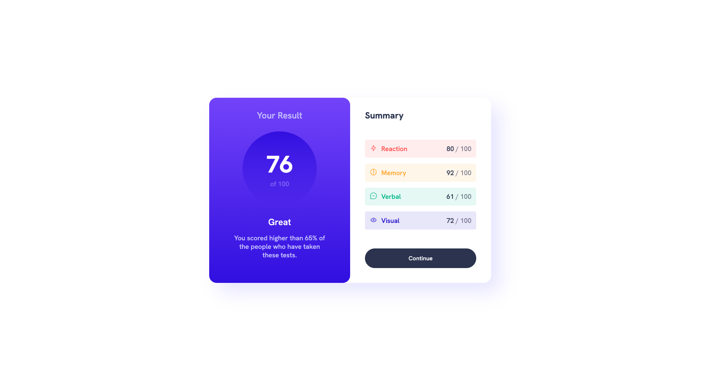

# Frontend Mentor - Results summary component solution

This is a solution to the [Results summary component challenge on Frontend Mentor](https://www.frontendmentor.io/challenges/results-summary-component-CE_K6s0maV). Frontend Mentor challenges help you improve your coding skills by building realistic projects. 

## Table of contents

- [Overview](#overview)
  - [Screenshot](#screenshot)
  - [Links](#links)
- [My process](#my-process)
  - [Built with](#built-with)
  - [What I learned](#what-i-learned)
- [Author](#author)

## Overview

### Screenshot

### Links

- Solution URL: [solution URL](https://github.com/RobinThijsen/results-summary-component-main)
- Live Site URL: [live site URL](https://robinthijsen.github.io/results-summary-component-main/)

## My process

First step, write my html
Second, style this
Last but not least responsive and comment

### Built with

- Semantic HTML5 markup
- CSS custom properties
- Flexbox

### What I learned

I learn to use hsl/hsla type of color code. Usually I use hexa and rgb/rgba

## Author

- Frontend Mentor - [@RobinThijsen](https://www.frontendmentor.io/profile/RobinThijsen)
- GitHub - [Robin Thijsen](https://github.com/RobinThijsen)